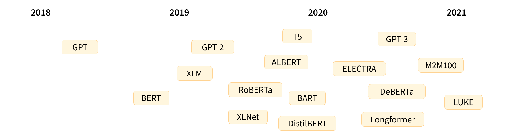
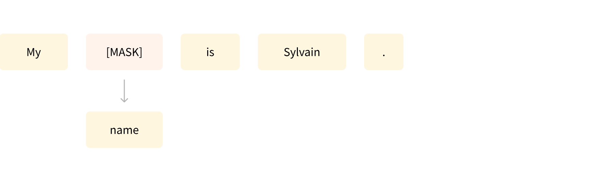

# 1. Transformer Models 
- [1. Transformer Models](#1-transformer-models)
  - [1.1. Introduction](#11-introduction)
  - [1.2. NLP](#12-nlp)
  - [1.3. Transformers](#13-transformers)
    - [1.3.1. zero-shot-classification](#131-zero-shot-classification)
  - [1.4. How do Transformers work](#14-how-do-transformers-work)
    - [1.4.1. General architecture](#141-general-architecture)
  - [1.5. Encoder models](#15-encoder-models)
  - [1.6. Decoder models](#16-decoder-models)
  - [1.7. Sequence-to-sequence models](#17-sequence-to-sequence-models)
  - [1.8. Bias and limitations](#18-bias-and-limitations)
  - [1.9. References](#19-references)

## 1.1. Introduction

## 1.2. NLP

NLP is a field of linguistics and machine learning focused on understanding everything related to human language. The aim of NLP tasks is not only to understand single words individually, but to be able to understand the context of those words.

The following is a list of common NLP tasks, with some examples of each:

- Classifying whole sentences: Getting the sentiment of a review, detecting if an email is spam, determining if a sentence is grammatically correct or whether two sentences are logically related or not
- Classifying each word in a sentence: Identifying the grammatical components of a sentence (noun, verb, adjective), or the named entities (person, location, organization)
- Generating text content: Completing a prompt with auto-generated text, filling in the blanks in a text with masked words
- Extracting an answer from a text: Given a question and a context, extracting the answer to the question based on the information provided in the context
- Generating a new sentence from an input text: Translating a text into another language, summarizing a text
NLP isn’t limited to written text though. It also tackles complex challenges in speech recognition and computer vision, such as generating a transcript of an audio sample or a description of an image.

## 1.3. Transformers 

- Transformer models are used to solve all kinds of NLP tasks
  - feature-extraction (get the vector representation of a text)
  - fill-mask
  - ner (named entity recognition)
  - question-answering
  - sentiment-analysis
  - summarization
  - text-generation
  - translation
  - zero-shot-classification

### 1.3.1. zero-shot-classification
- This pipeline is called zero-shot because you don’t need to fine-tune the model on your data to use it. It can directly return probability scores for any list of labels you want!

```
from transformers import pipeline

classifier = pipeline("zero-shot-classification")
classifier(
    "This is a course about the Transformers library",
    candidate_labels=["education", "politics", "business"],
)
```

```
{'sequence': 'This is a course about the Transformers library',
 'labels': ['education', 'business', 'politics'],
 'scores': [0.8445963859558105, 0.111976258456707, 0.043427448719739914]}
```
## 1.4. How do Transformers work 


This list is far from comprehensive, and is just meant to highlight a few of the different kinds of Transformer models. Broadly, they can be grouped into three categories:

- GPT-like (also called auto-regressive Transformer models)
- BERT-like (also called auto-encoding Transformer models)
- BART/T5-like (also called sequence-to-sequence Transformer models)

- Language models
- Transfer learning 
  - Pretraining: is the act of training a model from scratch: the weights are randomly initialized, and the training starts without any prior knowledge.
  - Fine-tuning, on the other hand, is the training done after a model has been pretrained. To perform fine-tuning, you first acquire a pretrained language model, then perform additional training with a dataset specific to your task.
  - Pretrained model: was already trained on a dataset that has some similarities with the fine-tuning dataset. The fine-tuning process is thus able to take advantage of knowledge acquired by the initial model during pretraining (for instance, with NLP problems, the pretrained model will have some kind of statistical understanding of the language you are using for your task).
  - 
- Causal language modeling 
- Masked language modeling



### 1.4.1. General architecture 

- Encoder
- Decoder 

- Encoder-only models
- Decoder-only models
- Encoder-decoder models = sequence-to-sequence models

- Architecture: This is the skeleton of the model — the definition of each layer and each operation that happens within the model.
- Checkpoints: These are the weights that will be loaded in a given architecture.
- Model: This is an umbrella term that isn’t as precise as “architecture” or “checkpoint”: it can mean both. This course will specify architecture or checkpoint when it matters to reduce ambiguity.
## 1.5. Encoder models
- Encoder models use only the encoder of a Transformer model. At each stage, the attention layers can access all the words in the initial sentence. These models are often characterized as having “bi-directional” attention, and are often called auto-encoding models.
  - ALBERT
  - BERT 
  - DistilBERT 
  - ...

- Encoder models are best suited for tasks requiring an understanding of the full sentence, such as sentence classification, named entity recognition (and more generally word classification), and extractive question answering.


## 1.6. Decoder models

## 1.7. Sequence-to-sequence models

## 1.8. Bias and limitations

## 1.9. References

- Huggingface Transformer documentation 
