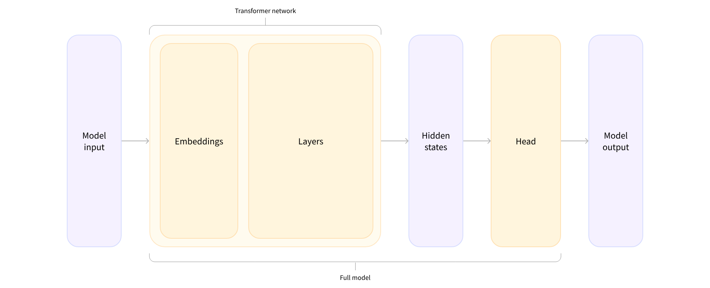
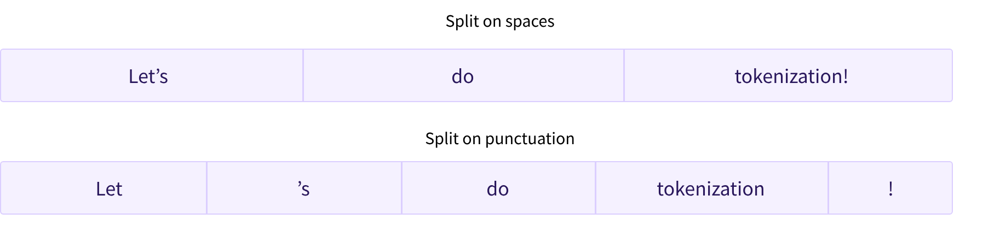
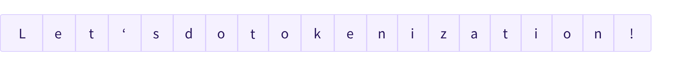

# 1. Using Transformers 
- [1. Using Transformers](#1-using-transformers)
  - [1.1. Introduction](#11-introduction)
  - [1.2. Behind the pipeline](#12-behind-the-pipeline)
  - [1.3. Models](#13-models)
    - [1.3.1. Creating a Transformer](#131-creating-a-transformer)
    - [1.3.2. Load pretrained models](#132-load-pretrained-models)
    - [1.3.3. Save models](#133-save-models)
  - [1.4. Tokenizer](#14-tokenizer)
    - [1.4.1. Loading and saving](#141-loading-and-saving)
    - [1.4.2. Encoding](#142-encoding)
      - [1.4.2.1. Tokenization](#1421-tokenization)
      - [1.4.2.2. From tokens to input IDs](#1422-from-tokens-to-input-ids)
    - [1.4.3. Decoding](#143-decoding)
    - [1.4.4. Fast Tokenizer](#144-fast-tokenizer)
  - [1.5. Handling multiple sequences](#15-handling-multiple-sequences)
    - [1.5.1. Models expect a batch of inputs](#151-models-expect-a-batch-of-inputs)
    - [1.5.2. Padding the inputs](#152-padding-the-inputs)
    - [1.5.3. Attention masks](#153-attention-masks)
    - [1.5.4. Longer sequences](#154-longer-sequences)

## 1.1. Introduction

## 1.2. Behind the pipeline

- Batch size: The number of sequences processed at a time (2 in our example).
- Sequence length: The length of the numerical representation of the sequence (16 in our example).
- Hidden size: The vector dimension of each model input.

## 1.3. Models

### 1.3.1. Creating a Transformer

### 1.3.2. Load pretrained models

### 1.3.3. Save models

## 1.4. Tokenizer
- Tokenizers are one of the core components of the NLP pipeline. They serve one purpose: to translate text into data that can be processed by the model. Models can only process numbers, so tokenizers need to convert our text inputs to numerical data. In this section, we’ll explore exactly what happens in the tokenization pipeline.

- Word-based: The first type of tokenizer that comes to mind is word-based. It’s generally very easy to set up and use with only a few rules, and it often yields decent results.

- Character-based: Character-based tokenizers split the text into characters, rather than words. This has two primary benefits:
  - The vocabulary is much smaller.
  - There are much fewer out-of-vocabulary (unknown) tokens, since every word can be built from characters.

- Subword tokenization: Subword tokenization algorithms rely on the principle that frequently used words should not be split into smaller subwords, but rare words should be decomposed into meaningful subwords.
- Byte-Level BPE : as used in GPT-2
- WordPiece: as used in BERT 
- SentencePiece or Unigram: as used in multilingual models

### 1.4.1. Loading and saving

### 1.4.2. Encoding
- Translating text to numbers is known as encoding. Encoding is done in a two-step process: the tokenization, followed by the conversion to input IDs.
  - the first step is to split the text into words (or parts of words, punctuation symbols, etc.), usually called tokens. There are multiple rules that can govern that process, which is why we need to instantiate the tokenizer using the name of the model, to make sure we use the same rules that were used when the model was pretrained.
  - The second step is to convert those tokens into numbers, so we can build a tensor out of them and feed them to the model. To do this, the tokenizer has a vocabulary, which is the part we download when we instantiate it with the from_pretrained() method. Again, we need to use the same vocabulary used when the model was pretrained.

#### 1.4.2.1. Tokenization

#### 1.4.2.2. From tokens to input IDs

### 1.4.3. Decoding 

- Decoding is going the other way around: from vocabulary indices, we want to get a string. This can be done with the decode() method as follows:

### 1.4.4. Fast Tokenizer 

- (tokenization, From tokens to inputs IDs) => ([CLS], .... [SEP]) => ([101] ... [102])

## 1.5. Handling multiple sequences 

- How do we handle multiple sequences?
- How do we handle multiple sequences of different lengths?
- Are vocabulary indices the only inputs that allow a model to work well?
- Is there such a thing as too long a sequence?

### 1.5.1. Models expect a batch of inputs
- Batching is the act of sending multiple sentences through the model, all at once. If you only have one sentence, you can just build a batch with a single sequence:
- Batching allows the model to work when you feed it multiple sentences. Using multiple sequences is just as simple as building a batch with a single sequence. There’s a second issue, though. When you’re trying to batch together two (or more) sentences, they might be of different lengths. If you’ve ever worked with tensors before, you know that they need to be of rectangular shape, so you won’t be able to convert the list of input IDs into a tensor directly. To work around this problem, we usually pad the inputs.
### 1.5.2. Padding the inputs 
-  we’ll use padding to make our tensors have a rectangular shape. Padding makes sure all our sentences have the same length by adding a special word called the padding token to the sentences with fewer values.

### 1.5.3. Attention masks 
- Attention masks are tensors with the exact same shape as the input IDs tensor, filled with 0s and 1s: 1s indicate the corresponding tokens should be attended to, and 0s indicate the corresponding tokens should not be attended to (i.e., they should be ignored by the attention layers of the model).

### 1.5.4. Longer sequences 